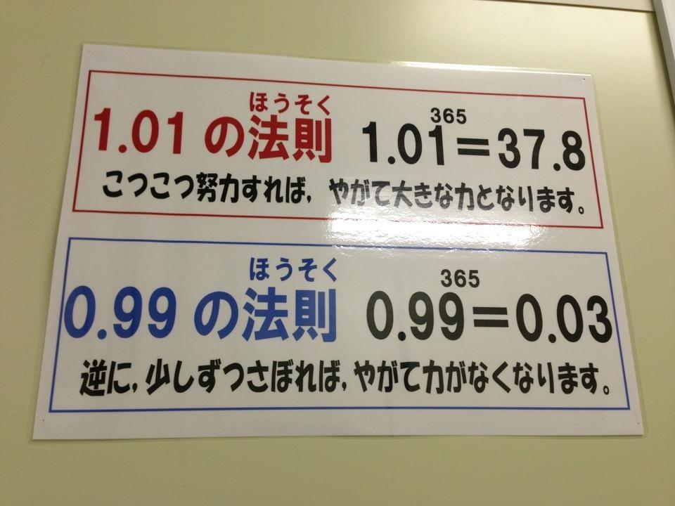

# Mathematical Foundations

## Types of Growth

(Image: Plot of n/log n/n2 )

The money in your bank account, the number of lines of code in your code base, the speed between two objects freefalling towards each other, the Gross Domestic Product of a nation.. These are natural systems that grow over time.

Not everything grows 'over time'. Consider the amount of time to put some out-of-order documents in order. If you have a particular way (called an algorithm) of sorting documents, and want to see how good your algorithm's behavior is, you may see how the time it takes to sort grows with the size of the list.

Some possibilities are:

  * If you sort a set that's 10 times larger, it takes you 10 times longer to do it.
  * If you sort a set that's 10 times larger, it takes you 100 times longer to do it.
  * If you sort a set that's 10 times larger, it takes you 3.05 times longer to do it

(The last one may surprise you, but in fact many sorting algo's in computers behave more or less like this)

### Growth Classes - Categories of Similar Growth

These possibilities can be chunked into several ranges, called Growth Classes. In computers, this gets referred to as Big-O notation, and provides a framework for talking about how fast things grow, whether over time, the size of the input, or whatever.

The main Growth classes you'll encounter are:

  * Linear growth
  * Squared growth
  * Logarithmic growth
  * Exponential growth

 Let's use our intuitive notions to understand these growth classes.

 * If you are filling a bucket from a garden hose - you need twice as long for twice as large a bucket. That is Linear Growth.

 * If you are tending a square garden, a garden of double the side-length will take you 4 times as long to tend. This is Squared Growth.

 * If I tell you I'm thinking of a number between 1 and 10, and let you guess, telling you "too high" or "too low" each time, and we compare the number of times you have to guess to the size of the range, this is Logarithmic Growth (more on this later).

 * And if the growth rate of a country - number of babies born per year - depends on its current size, then this is Exponential Growth.

Linear and Squared Growth need little explanation, and maybe Exponential Growth makes sense as well (we've heard of population explosions before)..

But Logarithmic Growth is subtle. It grows less quickly than a corresponding linearly-growing thing. It's more like - if you're building a pyramid of blocks, the pyramid does not get twice as high if you add twice as many blocks, because the base is wider. If you're guessing numbers between 1-100, vs 1-101, there's a good chance it'll take the same number of guesses. In this sense it's almost the opposite of squared growth - I'll have to double the size of the range to ensure that, on average, you have to make a single extra guess.

For things that take a long time, Logarithmic Growth is what we want, since eventually the marginal amount of time per new item is close to zero ! However, for things that we want to grow, like our bank accounts, Exponential Growth fits the bill quite nicely :)

### Short-run vs Long-run

Within a Growth Class there is room for variation. In the bucket-filling scenario we used to describe Linear Growth - the rate of bucket-filling will be small if the tap is barely open, or high if the tap is fully on. But in the long run, ANY process undergoing Linear Growth will be overtaken by ANY process experiencing Exponential Growth.

            Logarithmic < Linear < Squared < Exponential

What "the long run" means depends on the situation. You may be surprised to hear, that even with today's low interest rates, that your bank account is in the Exponential Growth class ! It may only grow 1% per year, but since you earn interest on interest, it is in fact exponentially growing. To speed up time a little bit, ponder this - if you get 1% better at something every day for an entire year, by what factor are you better at the end of the year ?

You'd be 37.8 times better imporving only 1% per day ! Too bad your bank account probably will not compound for 365 straight years.  For comparison, if your bank account experienced only Linear Growth, you would have merely 3.65 times the amount of money. This is the difference between "simple interest" and "compound interest". While it's true that in the short term, a 5% simple-interest account will be more profitable, a 1% compound interest account will eventually overtake.

### Limits of Explanatory Powers

This is the essence of Growth Classes - they are only truly useful "in the long run" to describe advantages. But, critically, by understanding the Growth Class a certain process is in, we gain the ability to reason about the long term behavior of a system. If all you know is the Growth Class of a system, as determined by measurements, you may be able to model of the insides of the system merely by analogy with something else in the same Growth class. A single measurement of a system may reveal very little, but the story of its size over time can affirm, or even contradict existing attempts to model the system. And so Growth Class is a very fundamental description of a system indeed.

In the marketplace, some lucky companies experience exponential growth in their revenues or stock prices. This is considered a Very Good Thing by investors and owners alike ! The meteoric rise of such stocks as Google, follows a predictable pattern, up to a point, but so far, every meteorically rising company has tapered off in the long run. This seems to imply that the Exponential Growth phase is an unstable one.

Take the story of the 64-square chessboard on which one grain of wheat is placed on the first square, two grains on the second square, and so forth until it would require more wheat than the entire world produces in a year to cover even half the chessboard.

Eventually an exponentially growing system will run into some natural limits, exhaust the resources available, or collide with another exponentially growing system. Growth Classes are most useful in predicting a system's behavior in the long run, and in isolation. With many independent entities competing in an environment, concepts from other parts of Mathematics may be more useful - for example, Dynamical Systems.
